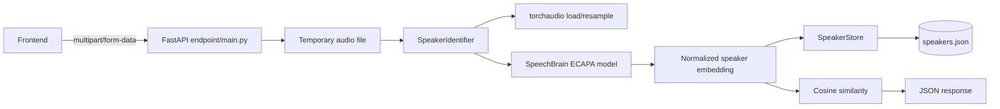

# Speaker Recognition API

This project provides a FastAPI backend for speaker enrollment and speaker identification.
It uses the SpeechBrain ECAPA-TDNN model to create speaker embeddings, stores enrolled
profiles in a local JSON file, and compares a new recording with all enrolled profiles.

The current API entry point is `endpoint.main:app`.

## Features

- Enroll a speaker with a name, email, and voice recording.
- Identify the closest enrolled speaker from a new recording.
- Return `unknown` when the best similarity score is below the configured threshold.
- List enrolled speakers without exposing their embeddings.
- Delete an enrolled speaker by email.
- Automatically convert stereo audio to mono and resample it to 16 kHz.
- Require enrollment recordings between 30 and 120 seconds; identification
  accepts any valid non-empty audio duration.
- Use CUDA when PyTorch detects an available GPU; otherwise use CPU.

## Architecture



### Request flow

1. FastAPI receives an uploaded audio file.
2. The file extension is checked against the allowed extensions.
3. The file is temporarily saved under `voices/` with a generated filename.
4. `SpeakerIdentifier` loads the audio with torchaudio.
5. Stereo audio is mixed to mono and non-16 kHz audio is resampled to 16 kHz.
6. SpeechBrain generates a normalized embedding.
7. Enrollment stores the embedding in `speakers.json`.
8. Identification compares the new embedding with every stored embedding.
9. The temporary uploaded file is deleted because `DELETE_AFTER_PROCESSING = True`.

The model is loaded once during FastAPI startup and reused by requests.

## Requirements

- Linux or another OS supported by PyTorch.
- Python 3.12.
- CUDA is optional. The configured PyTorch packages target CUDA 12.8.
- A clear recording containing one speaker.

## Installation

The repository contains a local virtual environment in `.venv/`. Install the declared
dependencies into it:

```bash
./.venv/bin/python -m pip install -r requirements.txt
```

Alternatively, activate the environment first:

```bash
source .venv/bin/activate
pip install -r requirements.txt
```

The first model startup may download model files if they are not already available
in `pretrained_models/spkrec-ecapa-voxceleb/`.

## Run the backend

From the project root:

```bash
./.venv/bin/python -m uvicorn endpoint.main:app --host 0.0.0.0 --port 8900
```

The API will be available at:

- Base URL: `http://localhost:8900`
- Swagger UI: `http://localhost:8900/docs`
- OpenAPI schema: `http://localhost:8900/openapi.json`

Use the dotted Python module path `endpoint.main:app`, not `endpoint/main:app`.

## Configuration

Configuration is in [config.py](config.py):

| Constant | Default | Description |
|---|---:|---|
| `MODEL_SOURCE` | `speechbrain/spkrec-ecapa-voxceleb` | SpeechBrain model identifier |
| `MODEL_DIR` | `pretrained_models/spkrec-ecapa-voxceleb` | Local model directory |
| `UPLOAD_DIR` | `voices` | Temporary upload directory |
| `MAX_FILE_SIZE_BYTES` | `20 MiB` | Maximum upload size |
| `MIN_AUDIO_SECONDS` | `30` | Minimum recording duration |
| `MAX_AUDIO_SECONDS` | `120` | Maximum recording duration |
| `DELETE_AFTER_PROCESSING` | `True` | Delete temporary uploads after processing |
| `THRESHOLD` | `0.3` | Minimum cosine similarity for a match |
| `ALLOWED_EXTENSIONS` | `.wav`, `.mp3`, `.flac`, `.ogg` | Accepted filename extensions |

To keep uploaded files after processing, change:

```python
DELETE_AFTER_PROCESSING = False
```

`THRESHOLD` is a cosine similarity threshold, not a probability. A production system
should calibrate it using recordings from known speakers and unknown speakers.

## API for the frontend

All audio endpoints use `multipart/form-data`. The file field name must be `audio`.
Do not send JSON for these endpoints.

### 1. Enroll a speaker

```http
POST /speakers/enroll
Content-Type: multipart/form-data
```

Form fields:

| Field | Type | Required | Description |
|---|---|---:|---|
| `name` | string | Yes | Speaker name |
| `email` | string | Yes | Speaker email; trimmed and lowercased |
| `audio` | file | Yes | WAV, MP3, FLAC, or OGG recording, 30–60 seconds long |

Example with JavaScript:

```javascript
const formData = new FormData();
formData.append("name", name);
formData.append("email", email);
formData.append("audio", audioFile);

const response = await fetch("http://localhost:8900/speakers/enroll", {
  method: "POST",
  body: formData,
});

const data = await response.json();
```

Successful response:

```json
{
  "status": "enrolled",
  "name": "Mohamed",
  "email": "mohamed@example.com",
  "embedding_dim": 192
}
```

Enrolling an existing email replaces that speaker's stored embedding and name.

### 2. Identify a speaker

```http
POST /speakers/identify
Content-Type: multipart/form-data
```

JavaScript example:

```javascript
const formData = new FormData();
formData.append("audio", audioFile);

const response = await fetch("http://localhost:8900/speakers/identify", {
  method: "POST",
  body: formData,
});

const result = await response.json();

if (result.identified) {
  console.log("Speaker:", result.best_match.name);
  console.log("Score:", result.best_match.score);
} else {
  console.log("Unknown speaker");
  console.log("Highest scores:", result.all_scores);
}
```

Matched response:

```json
{
  "identified": true,
  "threshold": 0.4,
  "best_match": {
    "name": "Mohamed",
    "email": "mohamed@example.com",
    "score": 0.86
  },
  "all_scores": [
    {
      "name": "Mohamed",
      "email": "mohamed@example.com",
      "score": 0.86
    }
  ]
}
```

Unknown response:

```json
{
  "identified": false,
  "threshold": 0.4,
  "best_match": null,
  "all_scores": [
    {
      "name": "Mohamed",
      "email": "mohamed@example.com",
      "score": 0.31
    }
  ]
}
```

`all_scores` is sorted from highest to lowest score. `best_match` is only populated
when the highest score is greater than or equal to `THRESHOLD`.

### 3. List speakers

```http
GET /speakers
```

Response:

```json
[
  {
    "name": "Mohamed",
    "email": "mohamed@example.com"
  }
]
```

Embeddings are intentionally not returned to the frontend.

### 4. Delete a speaker

```http
DELETE /speakers/mohamed%40example.com
```

Response:

```json
{
  "status": "deleted",
  "email": "mohamed@example.com"
}
```

The email must be URL encoded. For example, `@` becomes `%40`.

## curl examples

Enroll:

```bash
curl -X POST http://localhost:8900/speakers/enroll \
  -F "name=Mohamed" \
  -F "email=mohamed@example.com" \
  -F "audio=@voices/mohamed.wav"
```

Identify:

```bash
curl -X POST http://localhost:8900/speakers/identify \
  -F "audio=@voices/mohamed_test.wav"
```

List:

```bash
curl http://localhost:8900/speakers
```

Delete:

```bash
curl -X DELETE http://localhost:8900/speakers/mohamed%40example.com
```

## Error responses

| Status | Meaning |
|---:|---|
| `400` | Missing file extension, unsupported extension, invalid name/email, or file too large |
| `404` | No enrolled speakers, or speaker does not exist for deletion |
| `422` | FastAPI validation error, usually a missing form field |
| `500` | Unexpected model, audio decoding, or server error |

Example validation error:

```json
{
  "detail": "Invalid email format."
}
```

Use WAV, MP3, FLAC, or OGG. The recording must be 30–60 seconds long. MP4 is not
in the allowed list; convert it first, for example with ffmpeg:

```bash
ffmpeg -i input.mp4 -ac 1 -ar 16000 -c:a pcm_s16le output.wav
```

## Backend structure

```text
.
├── config.py                         # Runtime configuration constants
├── endpoint/
│   └── main.py                       # FastAPI app and HTTP endpoints
├── services/
│   ├── speaker_identifier.py         # Audio processing, model, embeddings, scores
│   └── speaker_store.py              # JSON persistence for speaker profiles
├── pretrained_models/
│   └── spkrec-ecapa-voxceleb/        # Local SpeechBrain model files
├── speakers.json                     # Enrolled names, emails, and embeddings
├── voices/                            # Temporary audio files and sample recordings
├── requirements.txt                  # Python dependencies
└── tests/                             # Tests and experiments
```

### Persistence format

The JSON store contains profiles similar to:

```json
[
  {
    "name": "Mohamed",
    "email": "mohamed@example.com",
    "embedding": [0.01, -0.02, 0.03]
  }
]
```

The real embedding contains 192 floating-point values. The frontend should never
depend on this internal format; use the API response models instead.

## Frontend integration notes

- Keep the audio input field name exactly `audio`.
- Do not manually set the `Content-Type` header when using `FormData`; the browser
  adds the multipart boundary automatically.
- Disable the identify button while the request is processing because model inference
  can take several seconds on the first request.
- Display `identified` as the source of truth, not only the numeric score.
- Validate recording duration in the frontend when possible, but treat the backend
  response as authoritative. Recordings shorter than 30 seconds or longer than 60
  seconds return `400`.
- Show `best_match` only when it is not `null`.
- Show `all_scores[0].score` as diagnostic information for an unknown result if needed.
- The backend currently has no authentication, authorization, rate limiting, or CORS
  configuration. Put it behind an authenticated backend or reverse proxy before
  exposing it outside a trusted network.

## Development checks

Compile-check the backend:

```bash
./.venv/bin/python -m py_compile endpoint/main.py services/*.py config.py
```

Check the application import without starting the server:

```bash
./.venv/bin/python -c "import endpoint.main; print(endpoint.main.app.title)"
```

## Alternative Pyannote backend

The project also contains an independent backend based on Hugging Face's
`pyannote/embedding` model. It does not reuse `speakers.json`; profiles are
stored in `pyannote_speakers.json` because embeddings from different models
must not be compared.

Install its optional dependencies and configure Hugging Face access:

```bash
./.venv/bin/python -m pip install -r requirements-pyannote.txt
export HF_TOKEN="hf_your_token_here"
```

The Hugging Face model terms must be accepted before downloading the model.
Start this backend on its separate port:

```bash
./.venv/bin/python -m uvicorn pyannote_endpoint.main:app \
  --host 0.0.0.0 --port 8901
```

Its API contract is the same as the main backend. Full setup and architecture
details are in [pyannote_endpoint/README.md](pyannote_endpoint/README.md).
